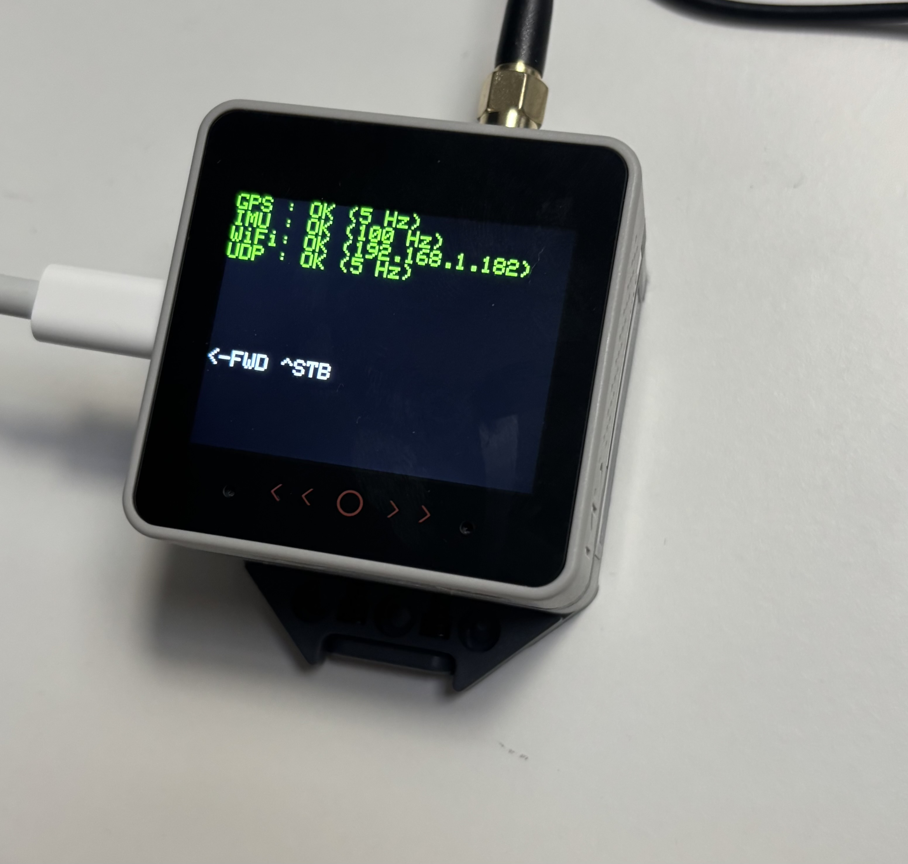

# gpsimu2ip
uses an M5 Stack ESP32 controller and GNSS module to provide GPS (RMC), Heel and Pitch data via NMEA over UDP.



**Initial configuration is**
- GPS output at 5hz
- IMU internal refresh (100hz)
- UDP output at 10hz
- Display update 1hz


# Parts
[M5 Stack Core S3 SE](https://shop.m5stack.com/products/m5stack-cores3-esp32s3-lotdevelopment-kit?srsltid=AfmBOooBjrRcmQfX4Ls7f4-QoIkYDgNVxXmuVoQinpfh3KtxQ-GVJX3A)

[GNSS Module with IMU](https://shop.m5stack.com/products/gnss-module-with-barometric-pressure-imu-magnetometer-sensors?srsltid=AfmBOorUYsZstzVM0wU1aUoTbz5d52dBKPwS9WHpqgLIYkI7fgVtVrVr)


# Example output
```
$GNRMC,203043.00,A,3251.73631,S,15220.32322,E,0.938,,240125,,,A,V*0B
$IIXDR,A,-1,D,PITCH*10
$IIXDR,A,20,D,HEEL*7D
```

# GPS configuration
By default the NEO-M9N ublox GPS chip in the GNSS module operates at 1hz and outputs lots of additional messages. To configure it, upload a serial passthrough sketch to the M5 Stack so that the internal UART (GPS) is bridged to the external UART (USB Port). Then connect to a computer and use u-center to configure the GPS module via the GUI. I have configured 5hz updates and removed all messages from NMEA except for RMC.


# Installation
Use the Arduino IDE and install the following libraries:
- **M5Unified**
- **SparkFun BMI270 Arduino Library**
- **MadgwickAHRS** (included in the Arduino library manager)

Copy `secrets_template.h` to `secrets.h` and fill in your WiFi credentials.

# ToDo
- Code should self-configure the GPS unit to desired output
- Code should self-configure the IMU
